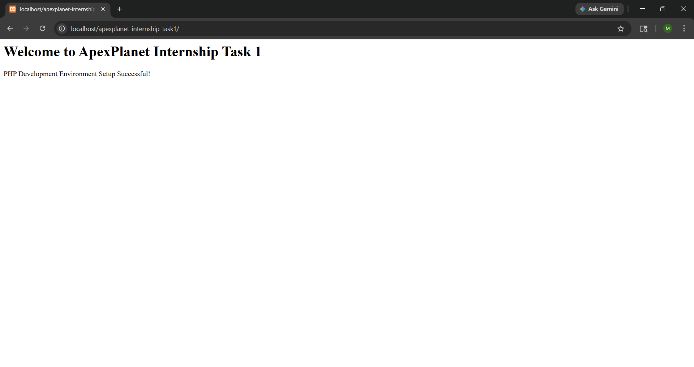
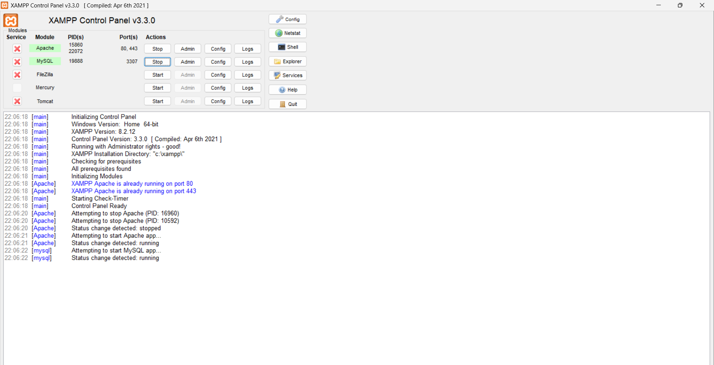
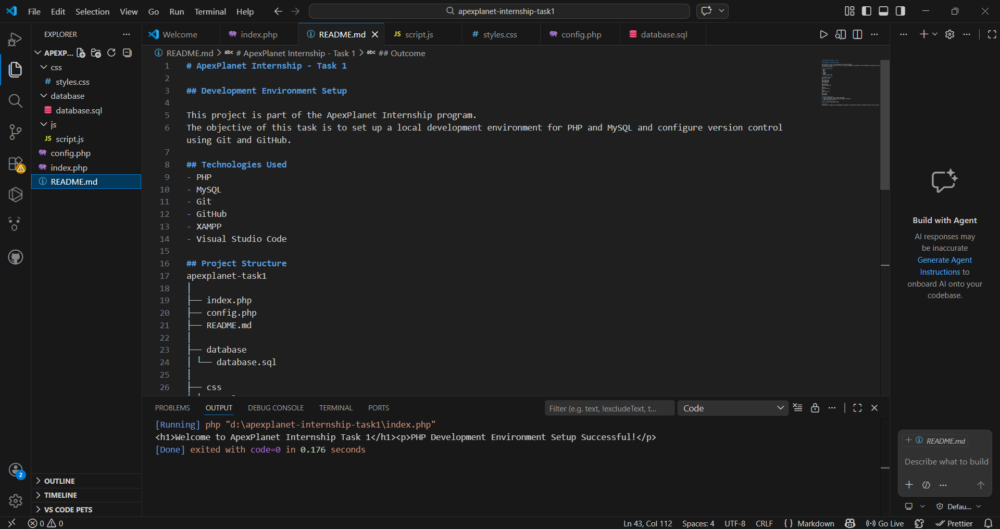

# ApexPlanet Internship - Task 1

## Development Environment Setup

This project is part of the ApexPlanet Internship program.  
The objective of this task is to set up a local development environment for PHP and MySQL and configure version control using Git and GitHub.

## Technologies Used
- PHP
- MySQL
- Git
- GitHub
- XAMPP
- Visual Studio Code

## Project Structure
apexplanet-task1
│
├── index.php
├── config.php
├── README.md
│
├── database
│ └── database.sql
│
├── css
│ └── style.css
│
├── js
│ └── script.js
│
└── assets
└── screenshots

## Setup Instructions
1. Install XAMPP and start Apache and MySQL.
2. Place the project folder inside the htdocs directory.
3. Open the browser and run:

http://localhost/apexplanet-internship-task1

## Outcome
Successfully configured the development environment and pushed the project to GitHub using Git version control.

## Screenshots

### Output

### XAMPP Running

### VS Code

